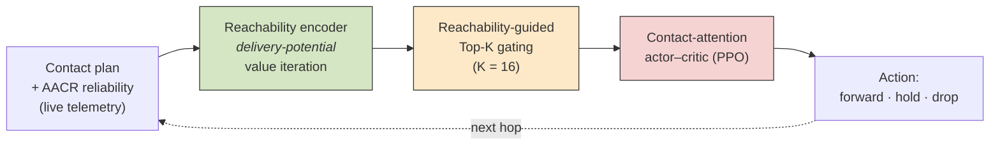
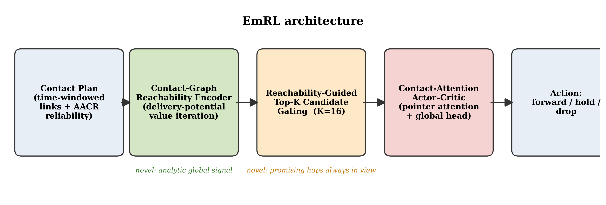
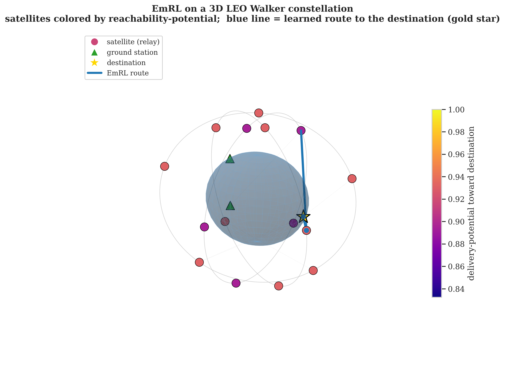
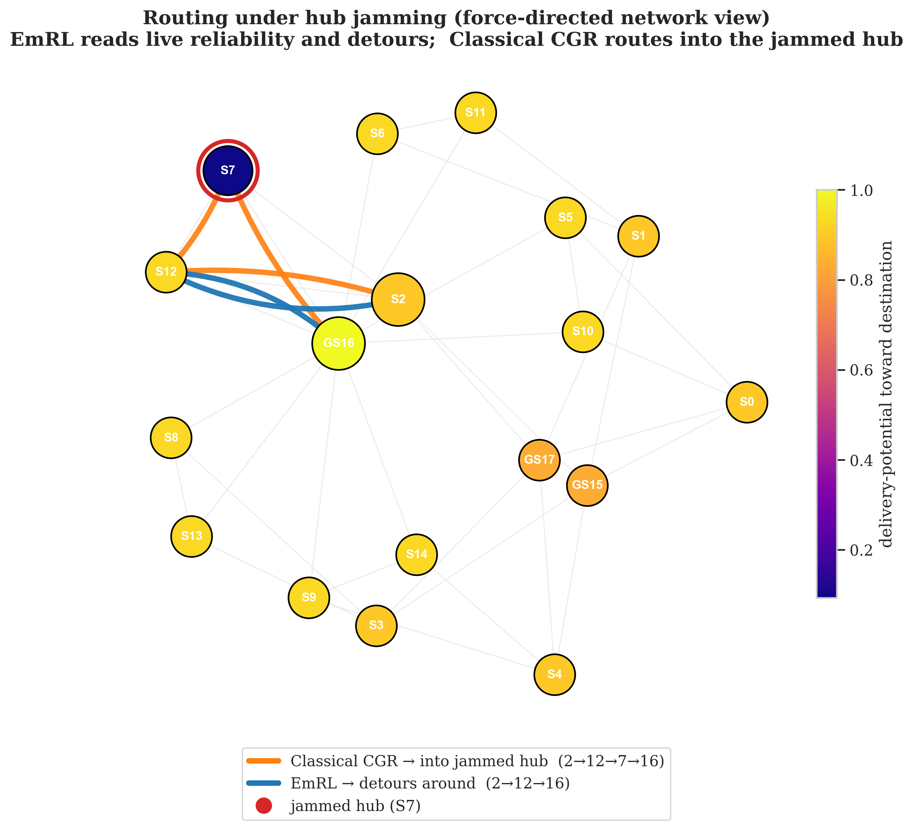
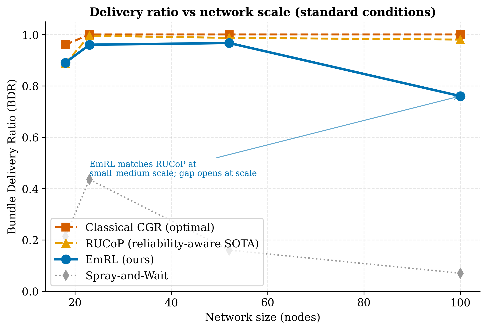

# EmRL: Self-Learning Contact Graph Routing for DTNs

Anomaly-aware reinforcement-learning router for Delay/Disruption-Tolerant
Networks (DTNs), built on PPO with a contact-attention backbone and
Anomaly-Aware Contact Reliability (AACR).

> **Headline result.** The destination-aware EmRL architecture **matches
> optimal Classical CGR on clean routing** (0.93 vs Dijkstra's 0.99; 0.88 vs
> 0.95 with stochastic failures) **and outperforms it under targeted hub
> jamming** — beating even idealized re-routing CGR by **+11–35%**, and
> realistic (pre-computed) CGR by far more. AACR adds +0.10–0.14 BDR.
> See `deliverables/RESULTS_FOR_MENTOR.md`.

---

## How EmRL works

Each hop, EmRL turns the contact plan into a **delivery-potential field** (how
likely each node is to reach the destination), uses it to **gate** the *K* most
promising candidate contacts into the policy's view, and a **contact-attention
PPO** head picks the next hop — forwarding on contacts that are both reliable
(AACR) and goal-directed.



**Training pipeline:**


### Architecture



### Reachability encoder + learned routing on a 3D LEO constellation



### Why it resists jamming — detour vs. route-into-the-hub



### Scales across constellation sizes



## Canonical models (`checkpoints/final/`)

| File | Description |
|------|-------------|
| `emrl_main_k16.pt`      | **Final EmRL** — wide observation (K=16), reliability-aware (BDR 0.68 @25% anomaly) |
| `emrl_bc_warmup_k16.pt` | BC warm-up weights for the K=16 model |
| `emrl_main_k10.pt`      | Earlier K=10 EmRL (BDR 0.78), used for K=10 ablations |
| `ablation_no_bc.pt`      | Ablation: trained without BC warm-up |
| `ablation_no_attn.pt`    | Ablation: trained without contact attention |
| `baseline_dqn.pt`        | DQN baseline |

## Setup

```bash
uv sync          # or: pip install -r requirements.txt
```

## Reproduce the headline result

```bash
# 1. (optional) train the final model — ~5 h on a single GPU
uv run python scripts/training/run_phase7_train.py

# 2. evaluate under adversarial bottleneck jamming
uv run python scripts/evaluation/run_drastic_difference.py     # CGR collapses, EmRL detours
uv run python scripts/evaluation/run_adversarial_targeting.py  # severity sweep

# 3. regenerate publication figures + tables
uv run python scripts/visualization/make_publication_outputs.py   # -> deliverables/
```

> Always run scripts **from the repository root** (they resolve `src/`,
> `checkpoints/`, and `results/` relative to the working directory).

## Key architecture notes

- **K-agnostic network.** The contact-attention backbone (`src/agents/networks.py`)
  infers the contact count from the observation width, so the same architecture
  trains at any K. The env (`src/env/dtn_env.py`) and routing adapter
  (`src/agents/rl_adapter.py`) take a `k_contacts` parameter (default 10).
- **Real anomaly injection.** `DTNRoutingEnv.reset(options={'anomaly_rate': r})`
  degrades a fraction of contacts per episode so the policy experiences
  reliability variance during training.
- **Reliability-shaped reward.** `reliability_shaping * (reliability - 0.5)` on
  contact commit teaches reliability-aware (AACR) routing.
