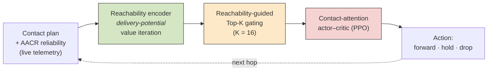
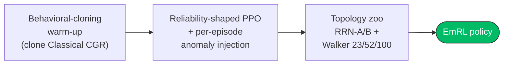
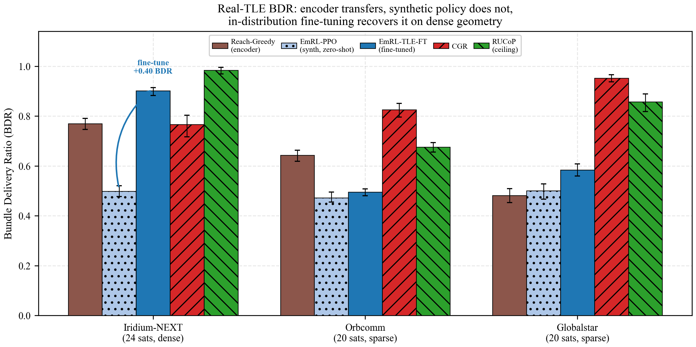
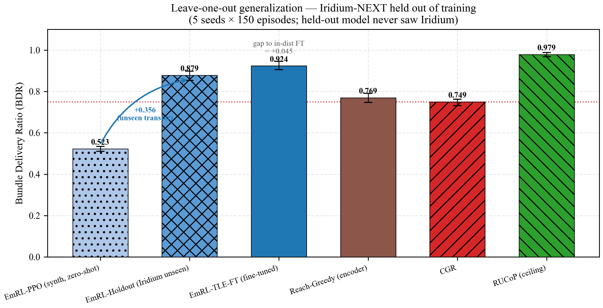
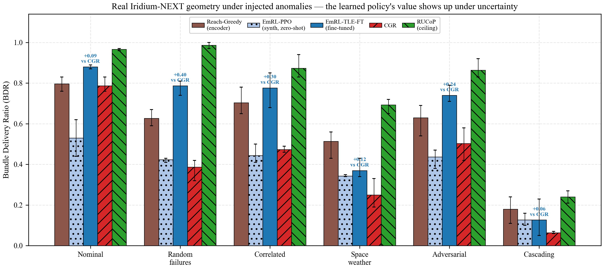

# EmRL: Self-Learning Contact Graph Routing for DTNs

A reachability-guided router for Delay/Disruption-Tolerant Networks (DTNs): a
**parameter-free analytic reachability encoder** paired with a **contact-attention
PPO policy** with Anomaly-Aware Contact Reliability (AACR).

> **Headline — the one-two punch.**
>
> **(1) A transferable analytic reachability encoder.** Parameter-free and
> GNN-free, it turns any contact plan into a delivery-potential field and
> **transfers zero-shot to real NORAD-TLE geometry** — matching re-planning
> Classical CGR with no learning and no precomputed uncertainty model.
>
> **(2) A learned policy that makes it anomaly-robust.** A contact-attention PPO
> head converts that signal into routing that, after a light in-distribution
> fine-tune, is the **most robust non-oracle router under injected anomalies** on
> dense real constellations (**+0.40 BDR over CGR under random link failures**),
> with the gain **generalizing to a held-out constellation** (0.879). In nominal
> in-distribution routing EmRL **ties the reliability-aware SOTA (RUCoP)** at a
> fraction of its modelling cost.
>
> All numbers come straight from `results/*.json`; see the figures below.

---

## How EmRL works

Each hop, EmRL turns the contact plan into a **delivery-potential field** (how
likely each node is to reach the destination), uses it to **gate** the *K* most
promising candidate contacts into the policy's view, and a **contact-attention
PPO** head picks the next hop — forwarding on contacts that are both reliable
(AACR) and goal-directed.



**Training pipeline:**



### Architecture


### Reachability encoder + learned routing on a 3D LEO constellation


### Why it resists jamming — detour vs. route-into-the-hub


### Scales across constellation sizes


### Validated on real orbital geometry (NORAD TLEs)

The analytic encoder transfers **zero-shot** to contact plans built from public
NORAD TLEs (Iridium-NEXT / Orbcomm / Globalstar, propagated via SGP4). A light
**in-distribution fine-tune** then rescues the learned policy on the dense Iridium
constellation (BDR 0.50 → 0.90), the benefit **generalizes to a held-out
constellation** (0.879), and the fine-tuned policy is the **most robust
non-oracle router under injected anomalies** (wins 4/6 scenarios; +0.40 BDR over
CGR under random link failures). The gain is constellation-specific — CGR remains
competitive on sparse Orbcomm/Globalstar.





> **Note on data.** All real-geometry results use **public NORAD TLEs only**
> (fetched from CelesTrak, cached under `data/tle/`). **No ESA telemetry was used
> in any training**, including the fine-tune.

## Canonical models (`checkpoints/final/`)

| File | Description |
|------|-------------|
| `emrl_main_k16.pt`      | **Final EmRL** — wide observation (K=16), reliability-aware (BDR 0.68 @25% anomaly); synthetic training |
| `emrl_bc_warmup_k16.pt` | BC warm-up weights for the K=16 model |
| `emrl_main_k10.pt`      | Earlier K=10 EmRL (BDR 0.78), used for K=10 ablations |
| `emrl_tle_ft_k16.pt`    | **Real-TLE fine-tune** (Phase 12, all 4 constellations) — warm-started from `emrl_main_k16.pt`; Iridium BDR 0.90 |
| `emrl_tle_ft_holdout_iridium-NEXT_k16.pt` | **Leave-Iridium-out fine-tune** — Iridium held out of training, still 0.879 (generalization, not memorization) |
| `ablation_no_bc.pt`      | Ablation: trained without BC warm-up |
| `ablation_no_attn.pt`    | Ablation: trained without contact attention |
| `baseline_dqn.pt`        | DQN baseline |

## Setup

```bash
uv sync          # or: pip install -r requirements.txt
```

## Reproduce the results

Evaluation uses the committed checkpoints, so no retraining is needed.

```bash
# Synthetic adversarial story — CGR collapses, EmRL detours
uv run python scripts/evaluation/run_drastic_difference.py
uv run python scripts/evaluation/run_adversarial_targeting.py   # severity sweep

# Real orbital geometry (NORAD TLEs; fetches + caches on first run)
uv run python scripts/evaluation/run_tle_eval.py        # zero-shot transfer + fine-tune recovery
uv run python scripts/evaluation/run_tle_holdout.py     # leave-one-out generalization (held-out Iridium)
uv run python scripts/evaluation/run_tle_anomaly.py     # real geometry under injected anomalies

# Reliability-aware SOTA comparison (RUCoP-anchored)
uv run python scripts/evaluation/run_rucop_benchmark.py

# Regenerate figures (-> deliverables/figures/)
uv run python scripts/visualization/make_publication_outputs.py
uv run python scripts/visualization/run_tle_figures.py   # fig17/18/19 — real-TLE finetune, held-out, anomaly
```

Optional — retrain from scratch (long; not required to reproduce results above):

```bash
uv run python scripts/training/run_phase7_train.py                          # synthetic, ~5 h on a single GPU
uv run python scripts/training/run_tle_finetune.py                          # real-TLE fine-tune, ~7.4 h -> emrl_tle_ft_k16.pt
TLE_HOLDOUT=iridium-NEXT uv run python scripts/training/run_tle_finetune.py # held-out variant, ~0.75 h
```

> Always run scripts **from the repository root** (they resolve `src/`,
> `checkpoints/`, and `results/` relative to the working directory).

## Key architecture notes

- **K-agnostic network.** The contact-attention backbone (`src/agents/networks.py`)
  infers the contact count from the observation width, so the same architecture
  trains at any K. The env (`src/env/dtn_env.py`) and routing adapter
  (`src/agents/rl_adapter.py`) take a `k_contacts` parameter (default 10).
- **Real anomaly injection.** `DTNRoutingEnv.reset(options={'anomaly_rate': r})`
  degrades a fraction of contacts per episode so the policy experiences
  reliability variance during training.
- **Reliability-shaped reward.** `reliability_shaping * (reliability - 0.5)` on
  contact commit teaches reliability-aware (AACR) routing.
